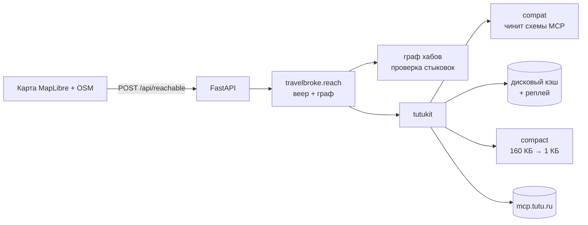

# TravelBroke

**Ты на мели. Мы всё равно тебя увезём.**

Тепловая карта досягаемости: задаёшь точку отправления, дату и бюджет —
видишь, **куда реально можешь уехать за эти деньги**. Не «сколько стоит билет
до Сочи», а «покажи всё, что мне по карману».

Работает на [MCP-сервере Туту](https://mcp.tutu.ru/mcp): самолёты, поезда,
автобусы и электрички в одном расчёте.

> Проект ИИ-хакатона Туту, 19–21 августа 2026.

---

## Чем отличается от поиска билетов

Обычный агрегатор ищет по паре «откуда — куда» и показывает прямые варианты.
TravelBroke строит **граф маршрутов** и находит составные пути, которые обычный
поиск не покажет никогда:

> Санкт-Петербург → Пенза напрямую — **11 557 ₽**.
> Санкт-Петербург → Москва, дальше Москва → Пенза — **4 010 ₽**.
> Разница — **7 547 ₽**, почти втрое.

Это не выдуманный пример: цифры сняты с живого MCP Туту на 22 августа 2026.
В том же прогоне из Петербурга нашлось **11 таких направлений**, из Москвы —
от четырёх до семи в зависимости от даты.

Города, куда выгоднее ехать с пересадкой, помечаются на карте отдельным бейджем
с точной экономией.

**Пересадка проверяется на выполнимость.** Составной маршрут засчитывается,
только если между прибытием и отправлением остаётся запас: час базово, плюс
полтора часа, если в связке есть самолёт, плюс час, если вокзалы разные.
Расписание Туту не знает о фактических задержках, поэтому стыковки впритык мы
не показываем вовсе. Подробности — в
[ADR-0004](docs/adr/0004-transfer-buffer.md).

**Мы не бронируем за пользователя.** Покупка остаётся осознанным действием.
TravelBroke берёт на себя перебор и
объяснение, а кнопку «купить» нажимает человек — по настоящему deeplink'у Туту.

---

## Как это работает



Три фазы расчёта:

1. **Брутфорс.** Веер `search_multitransport` из точки отправления по
   географически сбалансированному пулу до 380 городов, 8 параллельных
   запросов; всё складывается в дисковый кэш.
2. **Стыковки.** Для выгодных направлений проверяются плечи через хабы. Каждый
   найденный составной маршрут проходит проверку времени, аэропортов/вокзалов и
   лимита в три пересадки.
3. **Клиент.** Матрица цен уходит на фронт целиком, поэтому ползунки бюджета и
   времени перекрашивают карту мгновенно, без запросов к серверу.

Подробнее — в [docs/ARCHITECTURE.md](docs/ARCHITECTURE.md) и
[техническом задании](SPEC.md).

---

## Куда ищем

Географический каталог содержит **3 393 города в 208 странах**: от каждой
небольшой страны — до 15 крупнейших городов, от большой — до 50, всё с
населением от 20 000. Координаты и перечень городов берём из локальной базы
GeoNames, но каждый маршрут, цену и дату всё равно подтверждает Туту.

Число не на глаз — его можно снять с работающего кода:

```powershell
uv run python -c "from travelbroke.cities import global_catalog; print(len(global_catalog()))"
```

Один поиск берёт до **380** кандидатов. Россия включается полностью, а
международная часть распределяется квотами между Европой, Азией, Африкой,
Северной и Южной Америкой и Океанией. Это не даёт ближайшим странам вытеснить
дальние направления. Полная, готовая для слайдов спецификация — в
[docs/PRESENTATION_FACTS.md](docs/PRESENTATION_FACTS.md).

Пересадка при этом страной не ограничена. Из Набережных Челнов прямых рейсов в
Стамбул нет, а через Москву — есть за 16 963 ₽; Москва не показывается как
направление, но появляется на карте как точка пересадки, когда выбран Стамбул.

## Быстрый старт

Нужны [uv](https://docs.astral.sh/uv/) и Node 22+.

```powershell
# бэкенд
uv sync
uv run uvicorn travelbroke.api:app --reload

# фронтенд (в отдельном терминале)
cd web
npm install
npm run dev
```

API поднимется на `http://127.0.0.1:8000`, интерактивная документация —
на `http://127.0.0.1:8000/docs`.

### Проверка качества

```powershell
uv run pytest -q          # тесты
uv run ruff check .       # линт
uv run ruff format .      # форматирование
uv run mypy src           # типы
```

---

## API

| Метод | Путь | Назначение |
|---|---|---|
| `GET` | `/api/health` | Живость сервиса и доступность MCP |
| `POST` | `/api/reachable` | Матрица достижимых городов с ценами и временем |
| `GET` | `/api/progress` | Счётчик вызовов Туту — по нему рисуется полоса расчёта |
| `GET` | `/api/cities` | Справочник городов с координатами |
| `GET` | `/api/city-suggest?q=…` | Глобальные подсказки для поля города |
| `POST` | `/api/checkout` | Deeplink на выбранный конкретный оффер Туту |

Полная схема генерируется FastAPI и доступна на `/docs`.

---

## Оформление

Интерфейс собран как **прибор, а не как лендинг**: плоские плиты вместо
стеклянных карточек, волосяные линейки вместо теней, малые радиусы (14 px у
панели, 7 у органа управления, 3 у метки) и ни одного эмодзи — все знаки
нарисованы своими контурами в `web/src/components/Icon.tsx`, те же уходят на
карту жетонами на линии маршрута.

Шрифтовая пара с кириллицей:

| Роль | Гарнитура | Где |
|---|---|---|
| Заголовки | **Unbounded** 800 | строка бренда, название города |
| Интерфейс | **Onest** 400–700 | весь текст |
| Цифры | **JetBrains Mono** | цены, время, служебные метки (`.tb-num`, `.tb-tag`) |

Цифры всегда моноширинные и табличные: цена не должна прыгать по ширине, когда
двигаешь ползунок бюджета.

Тема намеренно только тёмная: лаймово-фиолетовая рампа на чернильной подложке
различается заметно лучше, чем на белой и не меняет контраст карты.

### Токены

Все цвета — в OKLCH, все объявлены в `web/src/index.css`. Единственный дубль
в проекте — `MAP_PALETTE` в `App.tsx`: полотно MapLibre рисует WebGL, куда
CSS-переменные не доходят.

| Токен | Значение | Роль |
|---|---|---|
| `--tb-bg` | `oklch(14.5% .028 277)` | подложка |
| `--tb-panel` | `oklch(19% .03 277)` | плита |
| `--tb-ink` | `oklch(96% .012 277)` | текст |
| `--tb-line` | `oklch(31% .035 277)` | волосяная линейка |
| `--tb-hero` | лайм `oklch(93.4% .223 122)` | главные числа |
| `--color-tb-accent` | `oklch(66% .2 283)` | кнопки, активные состояния |

### Рампа цены

Лайм (дёшево) → бирюза → глубокий фиолет (дорого), интерполяция в OKLCH.
Светлота падает по всей рампе монотонно: `93% → 76% → 52%`. Без этого выходила
радуга — и дешёвый лайм, и дорогая сирень были одинаково светлыми, порядок
«дешевле — дороже» глаз не читал, а дорогие города не выделялись вовсе.
Промежуточная точка задана явно и приглушена по насыщенности, иначе кратчайший
путь по тону проводит рампу через ядовитый бирюзовый и вся карта зеленеет.

Карта показывает только направления, проходящие текущие фильтры: так точки не
создают ложное ощущение, что до города уже можно доехать. Вернуть скрытые
варианты можно мгновенно — достаточно изменить бюджет, время или транспорт.

---

## Структура репозитория

```
src/travelbroke/     доменный слой: API, веер запросов, граф маршрутов
src/tutukit/         обвязка над MCP Туту: compat, client, cache, compact, diagnose
tests/               pytest
web/                 фронтенд: Vite + React + TypeScript + MapLibre
docs/                архитектура, ADR, пользовательская документация
```

Для сдачи и финального прогона есть [чек-лист требований хакатона](docs/HACKATHON_CHECKLIST.md).

### Про `tutukit`

Отдельный слой между приложением и MCP Туту. Решает четыре проблемы,
обнаруженные при разведке сервера:

- **`compat`** — чинит пять расхождений между документацией сервера и реальными
  схемами инструментов (у каждого поиска свой набор полей пассажиров, `checkout_ref`
  надо разворачивать, `details_ref` и `checkout_ref` путать нельзя).
- **`cache`** — дисковый кэш с реплеем: демо работает, даже если MCP недоступен.
- **`compact`** — ужимает ответы: поиск авиа отдаёт 160 КБ, в работу уходит ~1 КБ.
- **`diagnose`** — различает четыре причины пустого результата, которые сервер
  возвращает неотличимо друг от друга.

---

## Лицензия

MIT
