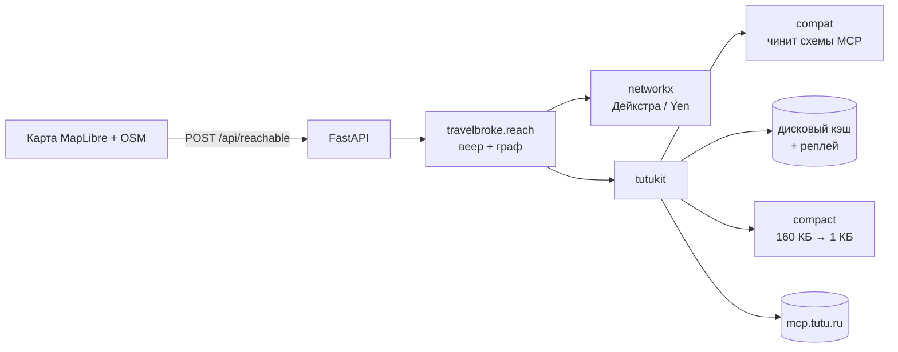

# TravelBroke

**Ты на мели. Мы всё равно тебя увезём.**

Тепловая карта досягаемости России: задаёшь точку отправления, дату и бюджет —
видишь, **куда реально можешь уехать за эти деньги**. Не «сколько стоит билет
до Сочи», а «покажи всё, что мне по карману».

Работает на [MCP-сервере Туту](https://mcp.tutu.ru/mcp): самолёты, поезда,
автобусы и электрички в одном расчёте.

> Проект ИИ-хакатона Туту, 19–21 августа 2026.

---

## Чем отличается от поиска билетов

Обычный агрегатор ищет по паре «откуда — куда» и показывает прямые варианты.
TravelBroke строит **граф маршрутов** и находит составные пути, которые обычный
поиск не покажет никогда:

> Санкт-Петербург → Пенза напрямую — **11 557 ₽**.
> Санкт-Петербург → Москва, дальше Москва → Пенза — **4 010 ₽**.
> Разница — **7 547 ₽**, почти втрое.

Это не выдуманный пример: цифры сняты с живого MCP Туту на 22 августа 2026.
В том же прогоне из Петербурга нашлось **11 таких направлений**, из Москвы —
от четырёх до семи в зависимости от даты.

Города, куда выгоднее ехать с пересадкой, помечаются на карте отдельным бейджем
с точной экономией.

**Пересадка проверяется на выполнимость.** Составной маршрут засчитывается,
только если между прибытием и отправлением остаётся запас: час базово, плюс
полтора часа, если в связке есть самолёт, плюс час, если вокзалы разные.
Расписание Туту не знает о фактических задержках, а 60% обращений
путешественников в 2026 году вызваны именно ими — поэтому стыковки впритык мы
не показываем вовсе. Подробности — в
[ADR-0004](docs/adr/0004-transfer-buffer.md).

**Мы не бронируем за пользователя.** Исследование Expedia 2026 показывает, что
66% путешественников не доверят покупку AI-агенту. TravelBroke берёт на себя
перебор и объяснение, а кнопку «купить» нажимает человек — по настоящему
deeplink'у Туту.

---

## Как это работает



Три фазы расчёта:

1. **Брутфорс.** Веер `search_multitransport` из точки отправления по 40–60
   городам, 8 параллельных запросов, всё складывается в дисковый кэш.
2. **Граф.** Узлы — города, рёбра — рейсы с ценой, длительностью и видом
   транспорта. Дейкстра даёт минимальную цену, Yen k-shortest — три альтернативы
   на город. Пересадка засчитывается только при достаточном буфере времени.
3. **Клиент.** Матрица цен уходит на фронт целиком, поэтому ползунки бюджета и
   времени перекрашивают карту мгновенно, без запросов к серверу.

Подробнее — в [docs/ARCHITECTURE.md](docs/ARCHITECTURE.md) и
[техническом задании](SPEC.md).

---

## Куда ищем

В справочнике **128 городов**: Россия и 30 стран, куда Туту продаёт билеты —
СНГ, Турция, ОАЭ, Египет, Китай, Юго-Восточная Азия, Европа.

Пул направлений делится по стране отправления: либо поездки по своей стране,
либо режим **«только за границу»**. Держать оба сразу дорого — веер по всем
городам справочника не укладывается в разумное время; на один расчёт берётся
не более 70 ближайших кандидатов.

Пересадка при этом страной не ограничена. Из Набережных Челнов прямых рейсов в
Стамбул нет, а через Москву — есть за 16 963 ₽; Москва не показывается как
направление, но появляется на карте как точка пересадки, когда выбран Стамбул.

## Быстрый старт

Нужны [uv](https://docs.astral.sh/uv/) и Node 22+.

```powershell
# бэкенд
uv sync
uv run uvicorn travelbroke.api:app --reload

# фронтенд (в отдельном терминале)
cd web
npm install
npm run dev
```

API поднимется на `http://127.0.0.1:8000`, интерактивная документация —
на `http://127.0.0.1:8000/docs`.

### Проверка качества

```powershell
uv run pytest -q          # тесты
uv run ruff check .       # линт
uv run ruff format .      # форматирование
uv run mypy src           # типы
```

---

## API

| Метод | Путь | Назначение |
|---|---|---|
| `GET` | `/api/health` | Живость сервиса и доступность MCP |
| `POST` | `/api/reachable` | Матрица достижимых городов с ценами и временем |
| `GET` | `/api/trip/{city_id}` | Маршрут по шагам и ссылка на оплату |
| `GET` | `/api/cities` | Справочник городов с координатами |

Полная схема генерируется FastAPI и доступна на `/docs`.

---

## Палитра

Цена кодируется цветом, рампа строится интерполяцией в OKLCH.

| Токен | Цвет | Значение |
|---|---|---|
| `--tb-cheap` | `#d0ff1a` | дёшево |
| `--tb-expensive` | `#c1acff` | дорого |
| `--tb-accent` | `#7b61ff` | акцент, кнопки |
| `--tb-ink` | `#151047` | текст |
| `--tb-muted` | `#b9b6d6` | недостижимо за бюджет |

---

## Структура репозитория

```
src/travelbroke/     доменный слой: API, веер запросов, граф маршрутов
src/tutukit/         обвязка над MCP Туту: compat, client, cache, compact, diagnose
tests/               pytest
web/                 фронтенд: Vite + React + TypeScript + MapLibre
docs/                архитектура, ADR, пользовательская документация
```

### Про `tutukit`

Отдельный слой между приложением и MCP Туту. Решает четыре проблемы,
обнаруженные при разведке сервера:

- **`compat`** — чинит пять расхождений между документацией сервера и реальными
  схемами инструментов (у каждого поиска свой набор полей пассажиров, `checkout_ref`
  надо разворачивать, `details_ref` и `checkout_ref` путать нельзя).
- **`cache`** — дисковый кэш с реплеем: демо работает, даже если MCP недоступен.
- **`compact`** — ужимает ответы: поиск авиа отдаёт 160 КБ, в работу уходит ~1 КБ.
- **`diagnose`** — различает четыре причины пустого результата, которые сервер
  возвращает неотличимо друг от друга.

---

## Лицензия

MIT
